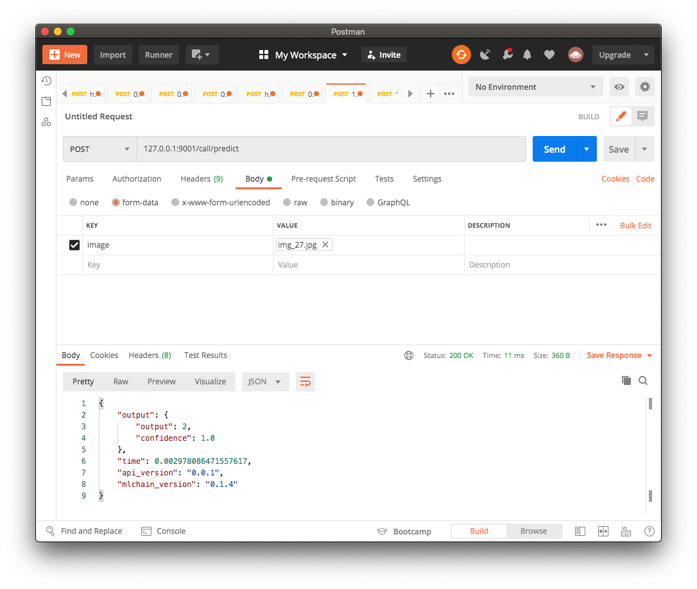
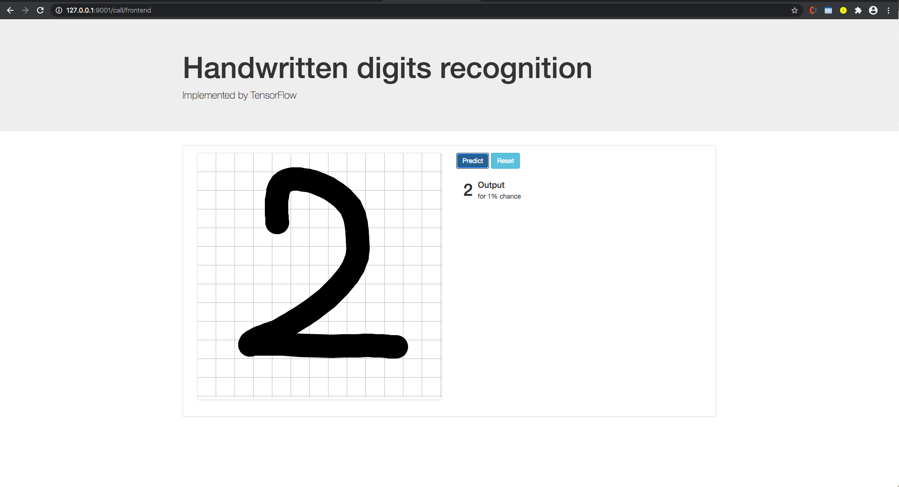
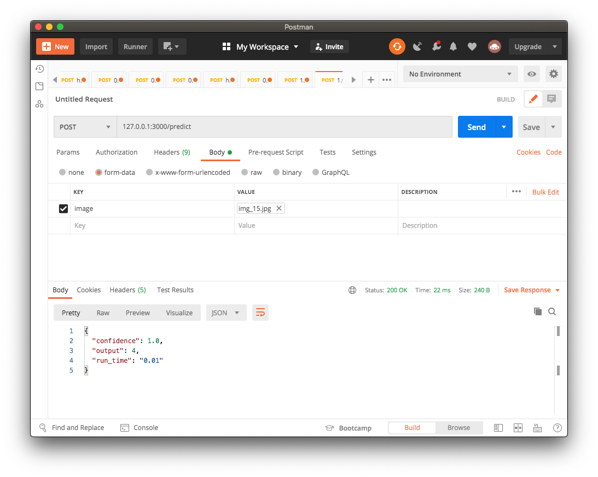
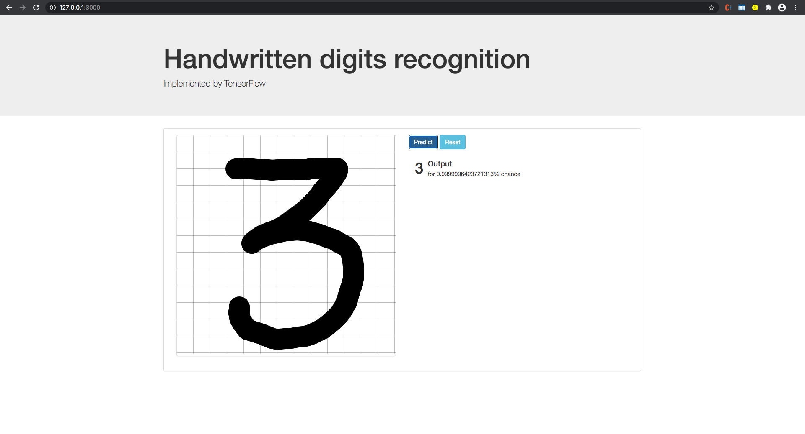

# MNIST MLChain Examples

This repo is a demonstration of using MLChain to serve a simple MNIST Classification model

## Setup

```console
git clone https://github.com/Techainer/mnist-mlchain-examples
cd mnist-mlchain-examples
pip3 install requirements.txt
```

## Serve using MLChain
Take a look at the configuration file [`mlconfig.yaml`](mlconfig.yaml) and see if you need to change anything.

Then run
```console
mlchain run
```

An API endpoint will be served at `127.0.0.1:9001/call/frontend`



And a frontend will be served at `127.0.0.1:9001/call/frontend`




## Interact with the Served API
To interact with the served API you can use Postman or the webpage already host above.

With Python, you can take a look at the [`test.py`](test.py) script to see how to use MLChain's Python `Client` class to communicate with the served API by MLChain in a very native and Pythonic manner.

We also show you how to use MLChain's `workflow` to take increase performance of your logic flow.


## Serve using Flask
Run
```console
python3 server_flask.py
```

An API endpoint will be served at `127.0.0.1:3000/predict`



And a frontend will be served at `127.0.0.1:3000`



### You can read more about `mlchain-python` [in here](https://github.com/Techainer/mlchain-python)